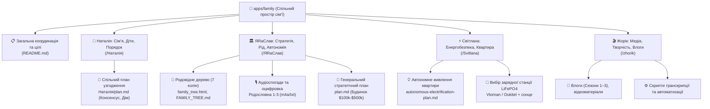
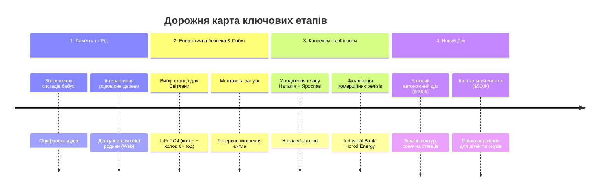
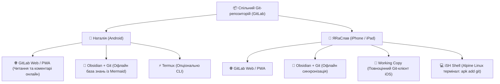

# 🏡 Family Space: Єдиний Координаційний План та Екосистема

> **Мета:** Спільний простір сім'ї для синхронізації цілей, збереження пам'яті роду, взаємної підтримки, енергетичної та фінансової безпеки, а також гармонізації суспільства і чіткого планування будівництва нового дому.

---

## 🗺️ 1. Загальна мапа репозиторію

---

## 🎯 2. Спільні цілі та синхронізація

Цей документ створений для того, щоб усі учасники сім'ї мали спільну прозору картину: **що ми робимо, для чого, скільки це коштує і в які терміни реалізується**.

---

## 🧭 3. Ключові напрямки та цілі учасників

### 3.1. Наталія — Сімʼя, Діти, Порядок
- **Головна мета:** Збереження теплої родинної атмосфери, спокій та здоровий розвиток дітей, щоденний лад і затишок.
- **Досьє та плани:** [Наталія/README.md](./Наталія/README.md)
- **Спільний план із Ярославом:** [Наталія/plan.md](./Наталія/plan.md)
  1. Синхронізація пріоритетів та потреб сім'ї на 2026 рік.
  2. Участь у плануванні та облаштуванні майбутнього автономного будинку під потреби дітей.
  3. Психологічний захист та спокій домашнього простору.

---

### 3.2. ЯRаСлав — Творення Життя, Будівництво, Автономія та Гармонізація
- **Головна мета:** Побудова 100% автономного сімейного будинку, захист життя та відновлення справедливості через закон.
- **Досьє та матеріали:** [ЯRаСлав/README.md](./ЯRаСлав/README.md)
- **Стратегічні орієнтири:** [ЯRаСлав/plan.md](./ЯRаСлав/plan.md)
  1. **Фінансовий фундамент:**
     - Завершення комерційних контрактів (Industrial Bank, модулі живлення Horod Energy).
     - Подолання блокування рахунків через прямі та альтернативні фінансові потоки.
  2. **Новий Будинок (Два рівні реалізації):**
     - **Рівень 1 ($100k):** Базовий автономний дім для швидкого переїзду сім'ї та безпеки дітей.
     - **Рівень 2 ($500k):** Повноцінний капітальний автономний родовий комплекс.
  3. **Гармонізація суспільства:**
     - Не війна, а виправлення помилок: притягнення посадових осіб до відповідальності згідно з Конституцією.
     - Справжня людяність та консенсус, бо бути людьми вигідно всім.

---

### 3.3. Світлана — Енергетичний комфорт та безпека житла
- **Головна мета:** Надійне тепло та безперебійна робота квартири в умовах можливих відключень світла.
- **Досьє:** [Svitlana/README.md](./Svitlana/README.md)
- **План дій:** [Svitlana/autonomous-electrification-plan.md](./Svitlana/autonomous-electrification-plan.md)
  1. **Резервне живлення для критичних приладів:**
     - Газовий котел опалення (150 Вт) + холодильник (150 Вт).
     - Необхідна автономність: від 6 годин (ємність акумулятора від **1 300 – 1 500 Вт·год**).
  2. **Обране обладнання:**
     - Пріоритет: станції LiFePO4 з чистим синусом та функцією ДБЖ (**Vtoman FlashSpeed 1500** або **Oukitel P2001E Plus**).
     - Опція сонячного підживлення: монокристалічна панель 200 Вт на балкон.
  3. **Бюджет реалізації:**
     - Базовий (станція + комутація): **~25 000 – 35 000 грн**.
     - Повний (станція + панель 200 Вт + кріплення + кабель): **~32 000 – 45 000 грн**.

---

### 3.4. Жорік — Творчість, Сімейний Архів та Медіа
- **Головна мета:** Організація сімейних фото/відео та розвиток відеоблогу.
- **Матеріали та інструкції:** [zhorik/README.md](./zhorik/README.md)
  - Архів влогів (Сезони 1, 2, 3), матеріали вихідних зйомок.
  - Автоматизовані конвеєри монтажу та субтитрів.

---

## 📊 4. Матриця синхронізації та розподілу бюджету

| Напрямок / Проєкт | Відповідальний | Потрібний ресурс / Орієнтовний бюджет | Очікуваний термін / Статус | Результат для сім'ї |
| :--- | :--- | :--- | :--- | :--- |
| **Спільний план узгодження** | Наталія + ЯRаСлав | Діалог, консенсус | Зафіксовано в `Наталія/plan.md` | Спільне розуміння кроків, спокій у домі |
| **Електроживлення квартири Світлани** | Світлана / ЯRаСлав | 27 000 – 40 000 грн | Серпень–вересень 2026 | Теплий дім, працюючий котел і холодильник при відключеннях |
| **Генеалогічне дерево (v1.0)** | ЯRаСлав | 0 грн (робота з даними) | У процесі (дані зібрані) | Спільне родовідне дерево доступне онлайн для всієї родини |
| **Запуск комерційних контрактів** | ЯRаСлав | Робочий час | Постійно | Формування накопичень на будівництво |
| **Базовий Дім ($100k)** | Наталія + ЯRаСлав | ~$100,000 | 2026–2027 | Своя земля, дім для дітей, автономне живлення |
| **Капітальний Родовий Маєток ($500k)** | Наталія + ЯRаСлав | ~$500,000 | Довгостроковий горизонт | Повна незалежність роду на покоління |

---

## 🤝 5. Як використовувати цей простір для узгодження

1. **Регулярний огляд:** Документ оновлюється під час зміни планів, вартості чи досягнення проміжних цілей.
2. **Прозорість фінансів:** Перед великими покупками чи кроками цифри фіксуються тут.
3. **Консенсус як основа:** Бути людьми та жити в консенсусі вигідно всім. Будь-які рішення обговорюються на основі спільних цінностей.

## 📱 6. Технічна Реалізація та Мобільний Доступ

Спільний репозиторій розрахований на зручний офлайн- та онлайн-доступ з персональних мобільних пристроїв кожного члена родини:

### Рекомендований набір інструментів:

| Платформа / Пристрій | Основний доступ (Читання & Плани) | Офлайн-робота з нотатками | Повноцінний Git / Термінал (CLI) |
| :--- | :--- | :--- | :--- |
| **Android (Наталія)** | **GitLab Web / PWA** (простий вхід за посиланням, красивий рендеринг) | **Obsidian** (плагін *Obsidian Git* — автономні плани зі схемами Mermaid) | **MGit** або **Termux** (`pkg install git`) |
| **iPhone / iPad (ЯRаСлав)** | **GitLab Web / PWA** | **Obsidian** (повна база знань на iPad/iPhone) | **Working Copy** (еталонний Git-клієнт iOS) + **iSH Shell** (консоль Linux) |

---

## 📜 7. Архів та Історія Роду (Глодов — Мироненко — Жирови)

> Повний текст родоводу та спогадів Людмили Мироненко винесено в окремий розділ спадщини: [HISTORY.md](./HISTORY.md) та інтерактивне дерево [FAMILY_TREE.md](./ЯRаСлав/FAMILY_TREE.md).

