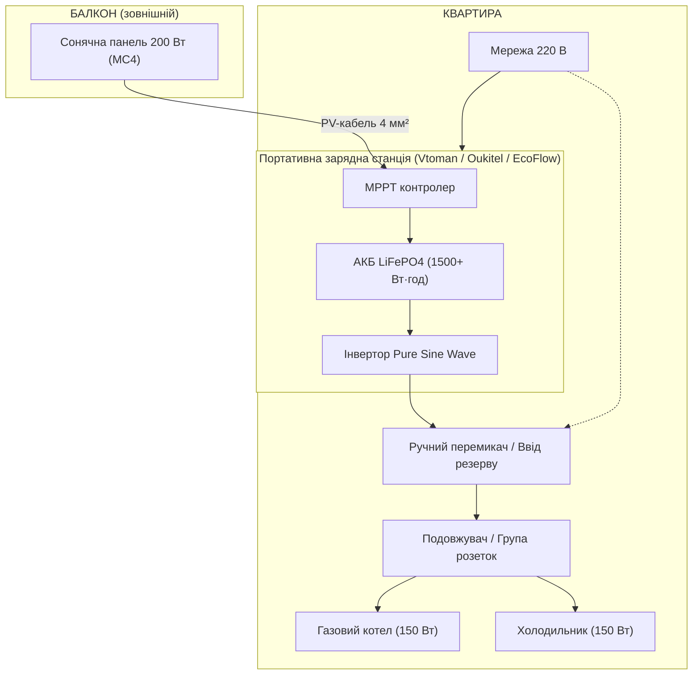

[← Головне меню (README.md)](../README.md) | [← Досьє Світлани (README.md)](./README.md)

# Автономне електропостачання квартири: план аварійного живлення

**Дата:** 12 серпня 2026  
**Мета:** Забезпечення резервного живлення котла та холодильника при відключенні світла на мінімум 6 годин  
**Навантаження:** Котел (150 Вт) + Холодильник (150 Вт номінально)

---

## 1. Розрахунок енергоспоживання

### Пікове навантаження

| Пристрій        | Потужність | Тип споживання                              |
| --------------- | ---------- | ------------------------------------------- |
| Котел опалення  | 150 Вт     | Постійне                                    |
| Холодильник     | 150 Вт     | Циклічне (компресор вмикається 20–30% часу) |
| **Разом (пік)** | **300 Вт** | —                                           |

### Споживання за 6 годин

- Котел: 150 Вт × 6 год = **900 Вт·год**
- Холодильник (середнє ~45 Вт через циклічність): 45 Вт × 6 год = **270 Вт·год**
- Разом навантаження: **1 170 Вт·год**
- Втрати інвертора (ККД ≈ 90%): 1 170 / 0,9 = **≈ 1 300 Вт·год**

**Висновок:** потрібна портативна електростанція з корисною ємністю не менше **1 300 Вт·год**.

---

## 2. Підбір обладнання (актуальні ціни та посилання, Україна 2026)

### 2.1. Портативні електростанції (1 000–2 000 Вт)

> ⚠️ **Примітка щодо вибору:** Попередньо розгляданий "Voltronic AK1500" є автомобільно-гібридним інвертором, а не моноблочною портативною станцією. Для квартири оптимально використовувати готові LiFePO4 станції із вбудованим ДБЖ (UPS) та чистим синусом.

| Модель | Ємність | Потужність інвертора | Тип АКБ | Зарядка AC | Ціна (грн) | Посилання на магазин |
| ------ | ------- | -------------------- | ------- | ---------- | ---------- | -------------------- |
| **Vtoman FlashSpeed 1500** | 1 548 Вт·год | 1 500 Вт (пік 3 000) | LiFePO4 | 1,0 год | 26 939 – 41 000 | [Rozetka](https://rozetka.com.ua/ua/576873604/p576873604/) |
| **Oukitel P2001E Plus** | 2 048 Вт·год | 2 400 Вт (пік 4 800) | LiFePO4 | 1,5 год | 24 000 – 43 377 | [KVShop](https://kvshop.com.ua/ru/zaryadnye-stantsii/oukitel/oukitel-p2001e-plus-2400w.html) |
| **EcoFlow Delta 3 Plus** | 1 024 Вт·год (розширювана) | 1 800 Вт (пік 2 700) | LiFePO4 | 1,1 год | 34 899 – 51 800 | [Rozetka](https://rozetka.com.ua/ua/zaryadnie-stantsii-4674585-ecoflow-156647822/p561086556) |
| **Fossibot F1800 / F1200** | 1 024 Вт·год | 1 800 Вт | LiFePO4 | 1,2 год | 26 990 – 27 999 | [Fossibot Store](https://fossibot-store.com.ua/product/fossibot-f1800) |
| **Allpowers S2000 Pro** | 1 500 Вт·год | 2 400 Вт | NCM | 1,0 год | 24 650 – 35 000 | [Allpowers Ukraine](https://allpowersukraine.com/products/s2000-pro-power-station) |
| **Bluetti AC180** | 1 152 Вт·год | 1 800 Вт (пік 2 700) | LiFePO4 | 1,0 год (Turbo) | 39 000 – 45 000 | [Епіцентр](https://epicentrk.ua/ua/shop/zariadna-stantsiia-bluetti-ac180-gb-plug-1800-vt-lifepo4-1152-vt-hod.html) |

### 2.2. Аналіз достатності ємності (на 6 годин автономності ~1 300 Вт·год)

| Модель | Корисна ємність (~90%) | Час роботи (котел + холодильник) | Вердикт |
| ------ | ---------------------- | -------------------------------- | ------- |
| **Oukitel P2001E Plus** | ~1 840 Вт·год | **~8,3 год** | 🏆 Найкращий резерв ємності та потужності |
| **Vtoman FlashSpeed 1500** | ~1 390 Вт·год | **~6,3 год** | ✅ Ідеальний баланс ціни та ємності |
| **Allpowers S2000 Pro** | ~1 350 Вт·год | **~6,1 год** | ✅ Надійний робочий варіант |
| **EcoFlow Delta 3 Plus** | ~920 Вт·год (1536 з доп. батареєю) | ~4,2 год (без доп. батареї) / ~6,3 год | ✅ Преміум якість, швидка зарядка |
| Fossibot F1200 / F1800 | ~920 Вт·год | ~4,2 год | ⚠️ Потрібен додатковий модуль акумулятора |
| Bluetti AC180 | ~1 037 Вт·год | ~4,7 год | ⚠️ Потребує економного режиму |

### 2.3. Сонячні панелі (до 200 Вт)

| Параметр | Значення |
| -------- | -------- |
| Тип | Монокристалічна (складна або жорстка) |
| Потужність | 200 Вт |
| Напруга холостого ходу (Voc) | ~45 В |
| Роз'єм | MC4 (універсальний) |
| Ціна | 2 800 – 5 500 грн |
| Бренди | Fossibot, Allpowers, EcoFlow, Jackery |

### 2.4. Де купити в Україні

| Магазин | Посилання |
| ------- | --------- |
| [ROZETKA](https://rozetka.com.ua/ua/zaryadnie-stantsii-4674585/c4674585/) | EcoFlow Delta 3, Vtoman, Oukitel, Allpowers |
| [Comfy](https://comfy.ua/ua/charging-stations/) | Bluetti, EcoFlow, Jackery |
| [Епіцентр](https://epicentrk.ua/ua/shop/portativnye-elektrostantsii/) | Allpowers, Bluetti, Jackery |
| [Dnipro-M / Nkon](https://dnipro-m.ua) | Fossibot F1200 / F1800 |
| [Motoblok.biz](https://www.motoblok.biz/) | EcoFlow Delta 3 Plus, Vtoman |

---

## 3. Архітектура системи

### 3.1. Компоненти комутації

| Компонент | Призначення | Орієнтовна вартість |
| --------- | ----------- | ------------------- |
| Ручний перекидний рубильник (3 позиції: Мережа — Вимкнено — Станція) | Безпечне перемикання джерел живлення | 800 – 1 500 грн |
| Або подвійна розетка з окремими групами живлення | Котел від станції, холодильник від мережі (або навпаки) | 300 – 600 грн |
| PV-кабель PV1-F 4 мм², 5–10 м | З'єднання панелі зі станцією | 200 – 600 грн |
| Роз'єми MC4 (комплект) | З'єднання кабелю з панеллю та станцією | 100 – 200 грн |
| Гофра захисна для кабелю | Прокладка кабелю по стіні | 100 – 200 грн |

### 3.2. Принцип роботи

1. **Нормальний режим (світло є):** Станція заряджається від міської мережі. Перемикач у положенні «Мережа». Котел і холодильник працюють від центрального електропостачання.
2. **Аварійний режим (світла немає):** Користувач переводить перемикач у положення «Станція» (або підключає прилади напряму в розетки станції / ДБЖ-автоматика). Інвертор електростанції подає 220В чистого синусу на котел і холодильник.
3. **Сонячна підзарядка:** У світлу пору доби сонячна панель живить MPPT-контролер станції, компенсуючи поточні витрати енергії.

---

## 4. Монтаж сонячної панелі на балкон

### Варіанти кріплення

| Спосіб | Опис | Вартість матеріалів |
| ------ | ---- | ------------------- |
| На парапет | Панель кріпиться до перила балкона, нахил 30° | 1 500 – 2 500 грн |
| На стіну балкона | Консольне кріплення до зовнішньої стіни | 2 000 – 3 000 грн |
| Підвісний (стеля балкона) | Панель закріплена горизонтально або з нахилом | 1 500 – 2 500 грн |

### Монтаж з протилежного боку балкона

Якщо панель розміщується на протилежному боці балкона (далеко від місця розташування електростанції), необхідно врахувати:

| Параметр | Значення | Примітка |
| -------- | -------- | -------- |
| Довжина PV-кабелю | 5–15 м | Залежить від відстані; чим довше кабель, тим більші втрати |
| Перетин кабелю | 4 мм² (до 8 м) / 6 мм² (понад 8 м) | Для мінімізації втрат напруги |
| Втрати напруги | 1–3% (4 мм²) / 1–2% (6 мм²) | MPPT контролер компенсує невеликі втрати |
| Прохід кабелю через вікно | Гофрована труба + ущільнювач | Забезпечити герметичність та захист від гризунів |
| Фіксація кабелю по стіні | Пластикові кліпси кожні 30–50 см | Уникають провисання та механічних пошкоджень |

### Вартість монтажу

| Робота | Вартість |
| ------ | -------- |
| Самостійний монтаж (матеріали) | 2 000 – 3 500 грн |
| Монтаж майстром (під ключ) | 4 000 – 8 000 грн |
| Прокладка кабелю з протилежного боку (+2–5 м кабелю, гофра, фіксатори) | +500 – 1 500 грн |

---

## 5. Сезонна продуктивність сонячної панелі в Україні

Продуктивність сонячної панелі суттєво залежить від пори року. Нижче — розрахунок для панелі **200 Вт** на широті України.

### Вироблення енергії по сезонах

| Сезон | Сонячних днів/міс | Середньодобове вироблення | Місячне вироблення | Автономних циклів (6 год) |
| ----- | ----------------- | ------------------------- | ------------------ | ------------------------- |
| **Літо** (червень–серпень) | 18–25 | 0,8–1,2 кВт·год | 14–30 кВт·год | 10–22 повних зарядів |
| **Весна** (березень–травень) | 12–20 | 0,4–0,7 кВт·год | 5–13 кВт·год | 4–9 повних зарядів |
| **Осінь** (вересень–листопад) | 8–15 | 0,2–0,5 кВт·год | 2–7 кВт·год | 1–5 повних зарядів |
| **Зима** (грудень–лютий) | 3–8 | 0,1–0,25 кВт·год | 1–2 кВт·год | <1 повний заряд |

---

## 6. Термін служби акумулятора LiFePO4

Портативні електростанції використовують літій-залізо-фосфатні (LiFePO4) акумулятори. Це ключовий параметр довговічності системи.

### Циклічний ресурс

| Параметр | Значення |
| -------- | -------- |
| Кількість циклів (при 80% DoD) | 3 000 – 6 000 циклів |
| Кількість циклів (при 50% DoD) | 4 000 – 8 000 циклів |
| Календарний термін служби | 10 – 15 років |
| Збережена ємність після 3 000 циклів | ≥ 80% від початкової |

---

## 7. Кошторис та порівняння варіантів (1 500 Вт·год)

### 7.1. БАЗОВИЙ варіант: Без сонячної панелі (лише мережева зарядка)

Базовий комплект призначений для живлення від міської мережі під час віялових відключень. При появі світла станція швидко відновлює заряд.

| Модель станції | Ємність / Потужність | Комплектація | Ціна станції (грн) | Комутація (рубильник/розетки) | **Підсумкова вартість** |
| -------------- | -------------------- | ------------ | ------------------ | ----------------------------- | ----------------------- |
| **Vtoman FlashSpeed 1500** | 1 548 Вт·год / 1500 Вт (LiFePO4) | Станція + кабель AC | 26 939 – 41 000 | 800 – 1 500 грн | **27 739 – 42 500 грн** |
| **Oukitel P2001E Plus** | 2 048 Вт·год / 2400 Вт (LiFePO4) | Станція + кабель AC | 24 000 – 43 377 | 800 – 1 500 грн | **24 800 – 44 877 грн** |
| **Allpowers S2000 Pro / S2000** | 1 500 Вт·год / 2400 Вт (**NCM**) | Станція + кабель AC | 24 650 – 34 999 | 800 – 1 500 грн | **25 450 – 36 499 грн** |

---

### 7.2. ПОВНИЙ варіант: З сонячною панеллю 200 Вт (автономне підживлення)

Повний комплект забезпечує підзарядку акумулятора вдень на балконі, подовжуючи автономну роботу при затяжних блек-аутах.

| Станція | Ціна станції | Панель 200 Вт (MC4) | PV-кабель 4 мм² + кріплення | Комутація | **Підсумкова вартість** |
| ------- | ------------ | ------------------- | --------------------------- | --------- | ----------------------- |
| **Vtoman FlashSpeed 1500** | 26 939 – 41 000 | 2 800 – 4 500 грн | 1 900 – 3 200 грн | 800 – 1 500 грн | **32 439 – 50 200 грн** |
| **Oukitel P2001E Plus** | 24 000 – 43 377 | 2 800 – 4 500 грн | 1 900 – 3 200 грн | 800 – 1 500 грн | **29 500 – 52 577 грн** |
| **Allpowers S2000 Pro** | 24 650 – 34 999 | 2 800 – 4 500 грн | 1 900 – 3 200 грн | 800 – 1 500 грн | **30 150 – 44 199 грн** |

---

### 7.3. Аналіз Allpowers S2000 / S2000 Pro (відгуки, особливості та ризики)

За запитом проведено поглиблений аналіз моделі **Allpowers S2000 / S2000 Pro** (Monster X Pro):

#### 1. Хімія акумулятора: NCM (Ternary Lithium), а не LiFePO4
* На відміну від Vtoman, Oukitel та EcoFlow, модель Allpowers S2000 побудована на акумуляторах **NCM (літій-нікель-марганець-кобальт)**.
* **Ресурс:** близько 800–1000 циклів (до 80% ємності) у базовій S2000 та ~1500–2500 циклів у S2000 Pro. Це значно менше, ніж у LiFePO4 (3000–6000 циклів).
* **Вага:** Завдяки NCM станція дещо легша (~14.5 кг), ніж аналоги на LiFePO4 (18–22 кг).

#### 2. Аналіз відгуків та поширених проблем (форуми та сервісні центри)
* ⚠️ **Перегрів при роботі в режимі ДБЖ (UPS):** Скарги на недостатній відвід тепла при тривалому постійному навантаженні. Вхідні конденсатори блоку живлення/зарядки прагнуть працювати на межі температурних допусків.
* ⚠️ **Збої контролера BMS:** Зафіксовані випадки "повисання" плати керування (дисплей не вмикається, станція реагує лише гулом вентиляторів).
* ⚠️ **Складність ремонту:** Сервісні майстерні відзначають високу теплоємність плат Allpowers (важко паяти) та дефіцит окремих мікросхем керування (наприклад, ШІМ-контролерів PL5500).
* ⚠️ **MPPT контролер сонячної панелі:** Деякі користувачі зазначають періодичне зависання MPPT-трекера при різкому зміненні хмарності (потребує перепідключення кабелю).

#### 3. Вердикт щодо Allpowers S2000 Pro
Allpowers S2000 Pro приваблює високою вихідною потужністю (2400 Вт), але поступається у довговічності елементів (NCM хімія) та надійності BMS/охолодження при режимі ДБЖ. Якщо пріоритет — надійне живлення котла 24/7 протягом кількох років, краще віддати перевагу **Vtoman FlashSpeed 1500** або **Oukitel P2001E Plus** на елементах **LiFePO4**.

---

## 8. Важливі зауваження

1. **Чистий синус (Pure Sine Wave):** Необхідний для коректної роботи циркуляційного насоса котла та компресора холодильника. Усі зазначені в таблиці станції мають чистий синус.
2. **Пускові струми:** Пускова потужність холодильника може сягати 800–1200 Вт у перші секунди. Інвертори потужністю 1500–2400 Вт легко це перекривають.
3. **Режим ДБЖ (UPS):** Станції Vtoman, Oukitel та EcoFlow підтримують час перемикання 10–20 мс, що дозволяє залишати котел підключеним постійно.

---

_Документ підготовлено на основі актуальних пропозицій українських магазинів станом на серпень 2026 року._

---
[← Головне меню (README.md)](../README.md) | [← Досьє Світлани (README.md)](./README.md)

