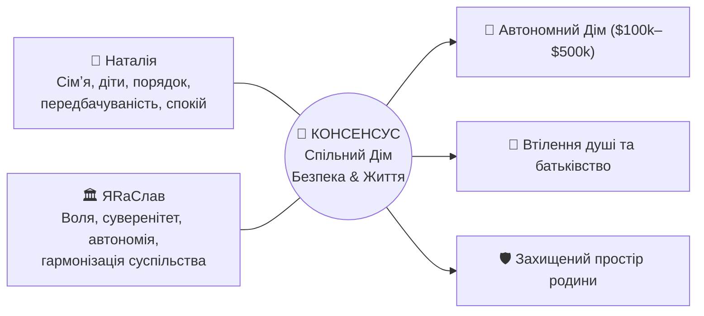
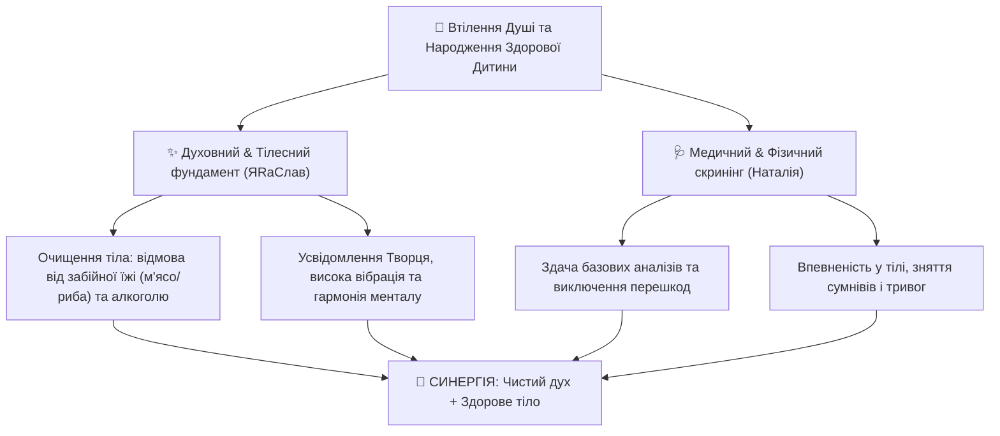

[← Головне меню (README.md)](../README.md) | [← Досьє Наталії (README.md)](./README.md)

# 🌿 Спільний План Родини: Наталія & ЯRаСлав

> **Фундамент співіснування:** Консенсус, взаєморозуміння, порядок, захист життя та гармонізація суспільства. Бути людьми вигідно всім. Жити в консенсусі — вигідно всім.

---

## 🕊️ 1. Спільне Бачення та Цінності

### 1.1. Прагнення Наталії:
- **Сімʼя:** Збереження теплої атмосфери, турбота, партнерство, взаємна повага.
- **Діти:** Бажання стати мамою, народження здорових діток у безпечному та спокійному середовищі.
- **Порядок:** Чіткість у побуті, чистота, передбачуваність фінансів, психологічний спокій.

### 1.2. Прагнення ЯRаСлава:
- **Творення Життя та Воля:** Людина народжена жити і творити. Гармонізація суспільства замість людожерства і терору.
- **Духовна та тілесна чистота:** Усвідомлення єдності всього сущого та багатовимірності Творця в кожній людині. Відмова від забійної їжі (м'ясо, риба) та алкоголю задля очищення менталу й астрального тіла.
- **Суверенна та фінансова незалежність:** Платформа [Will-n-I](../../../nan.web/apps/3rdparty/will-n-i/README.md), крипто-незалежність, прямі контракти, захист прав суверена.
- **Інженерна автономія:** Побудова родинного оазису ([UA-Oasis](../../horod/farms/underground-oasis/index.md)).

---

## 👶 2. Діти та Батьківство: Втілення Душі та Підготовка Батьків

Поява дітей — це духовне рішення душі втілитися у фізичному світі для проходження свого запланованого життєвого досвіду:

### Точки порозуміння:
1. **Духовна основа (бачення ЯRаСлава):** Діти народжуються там, де душа хоче пройти свій життєвий досвід. Для налаштування контакту з тонким (астральним) тілом та створення чистого простору необхідна відмова від забійної їжі (м'ясо, риба) та алкоголю. Очищення раціону — це прояв любові до життя та ненасильства.
2. **Медична перевірка (бачення Наталії):** Здати базові медичні аналізи, щоб перевірити фізичний стан організму, зняти хвилювання та забезпечити безпечний перебіг вагітності.
3. **Консенсус:** Одне доповнює інше. Ми поєднуємо **духовне й тілесне очищення (детокс раціону)** та **спокійний медичний чекап**, щоб батьки були готові комплексно — на духовному, ментальному та тілесному рівнях.

---

## 🏡 3. Спільна Ціль: Автономний Дім ($100k — $500k)

Будинок розглядається як родове гніздо, де поєднуються порядок і затишок Наталії з передовою автономією ЯRаСлава.

### Рівень 0: Тактичний План Виживання на Зиму 2026–2027 (Орендований Будинок ~70 м²)
> ⚡ **Мета:** Гарантоване тепло, енергонезалежність, зв'язок і комфортний побут родини тут і зараз без капітальних витрат у чужі стіни (все обладнання 100% мобільне та забирається з собою).

#### Модульна енергосистема (поетапне розширення):

1. **Модуль 1.1. Сонячне поле «Мінімум» (Бюджетний старт):**
   - **Конфігурація:** 2 × 550 Вт монокристалічні сонячні панелі (1,1 кВт пік).
   - **Монтаж:** Швидкознімне регульоване наземне кріплення (кут 50–60° для максимальної зимової генерації на низькому сонці та легкого очищення від снігу).
   - **Призначення:** Базова підтримка заряду станції в ясні зимові дні, живлення освітлення, зв'язку (Starlink/роутер), насосів та холодильника.

2. **Модуль 1.2. Сонячне поле «Повна Автономія» (+4 панелі):**
   - **Конфігурація:** 6 × 550 Вт панелей (разом 3,3 кВт пік = 2 стартові + 4 додаткові).
   - **Монтаж:** Наземна модульна ферма / розбірні кронштейни на ґрунті (без свердління даху орендодавця).
   - **Призначення:** Стабільне покриття денного споживання навіть у хмарну зимову погоду, активна підзарядка акумуляторів та живлення опалення у світлу пору доби.

3. **Модуль 1.3. Серце системи — Енергостанція / Накопичувач на 5 кВт·год:**
   - **База:** LiFePO4 акумуляторний блок (5,12 кВт·год, 48В) + інвертор із чистим синусом 3–5 кВт та вбудованим MPPT-контролером (підтримка високовольтного сонячного входу до 450–500В DC) або модульна зарядна станція відповідного класу.
   - **Можливості:** 
     - Забезпечує до 10–24 годин повної автономності будинку (освітлення, холодильник, інтернет, автоматика котла/насоси) або 4–6 годин інтенсивного обігріву тепловим насосом при блекауті.
     - Швидка зарядка від мережі, коли є струм, або від генератора/сонячного поля.

4. **Модуль 1.4. Енергоефективне Опалення 70 м² (Тепловий насос / Інверторний кондиціонер):**
   - **Конфігурація:** Інверторний тепловий насос «повітря-повітря» (Nordic / Arctic серія, робота на обігрів до -25°C / -30°C, SCOP/COP ≈ 3.5–4.5, потужність 18 000–24 000 BTU).
   - **Економіка та енергетика:** 
     - Споживаючи всього **0,8 – 1,2 кВт електроенергії**, видає **3,0 – 4,5 кВт тепла** — це в 3-4 рази ефективніше за звичайні електроконвектори чи керамічні панелі.
     - Пряме живлення від сонячного поля через інвертор або від станції (5 кВт·год станції вистачає для підтримки плюсової комфортної температури при короткочасних відключеннях, а в сонячний день — практично повністю безоплатне опалення 70 м²).

5. **Модуль 1.5. Морозильна скриня на ~300 л (Стратегічний запас вітамінів + Термоакумулятор + Фонове тепло):**
   - **Конфігурація:** Морозильна скриня (chest freezer) на 250–300 л класу A++/A+++ з інверторним компресором.
   - **Заготівля свіжих продуктів (здорове харчування):**
     - Довготривале зберігання сезонних органічних ягід, овочів, зелені, фруктів та напівфабрикатів без консервантів та хімії на всю осінь/зиму/весну.
     - Дозволяє оптово скуповувати якісні фермерські продукти в пік сезону за мінімальними цінами або заготовляти власний урожай.
   - **Як джерело тепла:**
     - Морозилка за термодинамічним принципом є тепловим насосом: вона відбирає тепло зсередини камери та скидає його на зовнішні стінки корпусу у приміщення.
     - У сталому режимі вона віддає у кімнату приблизно **40–80 Вт постійного корисного фонового тепла** (~1–1,5 кВт·год тепла на добу) без жодної втрати електроенергії.
   - **Енергетична безпека:**
     - Скриня з продуктами та замороженими пляшками води тримає холод **до 35–50 годин без електроенергії**.
     - Вдень при наявності сонячної генерації охолоджується до -24°C, накопичуючи холод і практично не споживаючи заряд акумулятора вночі.

---

#### 📊 Фінансовий План та Кошторис Тактичного Обладнання (Ціни 2026)

| № Модуля | Складова обладнання | Орієнтовна вартість (грн) | Орієнтовна вартість ($) | Примітки |
| :--- | :--- | :--- | :--- | :--- |
| **1.1** | **Сонячний старт 1.1 кВт** (2 × 550 Вт монокристал + наземні регульовані кріплення + кабелі MC4 6мм² 20м + захист DC) | **14 500 – 19 000 грн** | **~$350 – $460** | Панелі Tier-1 (Longi/Jinko/Trina) ~4 800 грн/шт + кріплення |
| **1.2** | **Розширення поля до 3.3 кВт** (+4 панелі 550 Вт + додаткові ферми кріплень + комутація) | **26 000 – 32 000 грн** | **~$630 – $780** | Дозволяє повністю закривати день навіть у похмуру погоду |
| **1.3** | **Енергоблок 5 кВт·год** (LiFePO4 48V 100Ah 5.12 кВт·год + гібридний інвертор 4.2–5.0 кВт з високовольтним MPPT) | **52 000 – 68 000 грн** | **~$1 250 – $1 650** | Deye / Anern / Must / PowMr або готова станція розширення |
| **1.4** | **Тепловий насос «повітря-повітря»** (Інверторний кондиціонер 18-24k BTU до -25°C + монтаж на підставку/кронштейни) | **32 000 – 46 000 грн** | **~$770 – $1 100** | Cooper&Hunter Arctic / Gree Nordic / Haier Flexis |
| **1.5** | **Морозильна скриня ~300 л** (Клас A++/A+++, електронне/інверторне керування, корисний об'єм 290–320 л) | **13 000 – 19 000 грн** | **~$310 – $460** | Gorenje / Beko / Liebherr / Midea |
| **Разом** | **Повний комплект автономії та обігріву** | **137 500 – 184 000 грн** | **~$3 310 – $4 450** | Усе обладнання мобільне і перевозиться у власне житло |

##### Сценарії фінансового входу:
1. **Сценарій «Критичний мінімум харчування + світло» (Модулі 1.1 + 1.3 + 1.5):**
   - **Бюджет:** **~79 500 – 106 000 грн (~$1 900 – $2 550)**
   - *Результат:* Світло, холодильник, морозилка на 300 л з вітамінним запасом, інтернет, свердловинний насос, автономія до доби.
2. **Сценарій «Повний тактичний захист з опаленням» (Усі модулі 1.1–1.5 разом):**
   - **Бюджет:** **~137 500 – 184 000 грн (~$3 310 – $4 450)**
   - *Результат:* 3.3 кВт сонячної генерації, 5 кВт·год батарея, кліматичний обігрів 70 м², запас продовольства на зиму, повна незалежність від міських мереж.

---

### Рівень А: Базовий Власний Автономний Дім (~$100,000)
- **Горизонт:** 2026–2027.
- **Ціль:** Створення постійного власного захищеного простору для сім'ї та дітей.
- **Складові:** Земельна ділянка, теплий швидкомонтований контур, свердловина з фільтрами, септик, сонячна електростанція 5–8 кВт (LiFePO4).

### Рівень Б: Капітальний Родовий Комплекс (~$500,000)
- **Архітектурна база:** Проєкт [UA-Oasis (Underground Oasis)](../../horod/farms/underground-oasis/index.md) (див. [README](../../horod/farms/underground-oasis/README.md), [business-plan.md](../../horod/farms/underground-oasis/business-plan.md), [architecture-map.md](../../horod/farms/underground-oasis/architecture-map.md)).
- **Складові:**
  - Підземний/напівпідземний житловий та фермерський комплекс подвійного призначення (купол Ø12м, кліматичні тунелі).
  - 100% геотермальна та сонячна енергія, накопичувачі енергії, V2G.
  - Власна свіжа органічна їжа цілий рік (агрономія, субтропіки, зелень, басейн).
  - Повний захист від природних катаклізмів, криз та воєнних загроз.

---

## ⚖️ 4. Фінансова та Правова Стійкість

Під час кризи, війни та свавілля банківсько-державної системи (блокування рахунків, тиск) ми не впадаємо у паніку і не ведемо сліпу «війну»:
1. **Гармонізація суспільства замість людожерства:** Через правовий протокол [Will-n-I](../../../nan.web/apps/3rdparty/will-n-i/MANIFESTO.md) ми спокійно відновлюємо справедливість і притягуємо порушників до відповідальності за Конституцією.
2. **Крипто-незалежність:** Взаємодія через децентралізовані криптогаманці, прямі контракти, готівковий резерв та бартер — це робить родину нечутливою до банківського терору.
3. **Множинні джерела фінансування:**
   - Запуск власної платформи розробки та консалтингу.
   - Фіналізація комерційних релізів (Industrial Bank).
   - Енергетичні модулі Horod Energy.
   - Запуск DAO та залучення співзасновників під [UA-Oasis](../../horod/farms/underground-oasis/cofounder-agreement.md).

---

## 🗓️ 5. Покроковий План Синхронізації на 2026 рік

| Етап | Зміст робіт | Мета для сім'ї | Хто веде |
| :--- | :--- | :--- | :--- |
| **1. Здоров'я & Батьківство** | Спільний детокс (тестовий період без забійної їжі/алкоголю) + базові медичні чекапи | Тілесна та духовна готовність до зачаття | Наталія + ЯRаСлав |
| **2. Енергетичний затишок** | Резервне живлення квартир (проєкт Світлани: LiFePO4 станція) | Спокій у побуті при відключеннях світла | Спільний |
| **3. Фінансовий рух** | Дохід через крипту та прямі контракти в обхід заблокованих карток | Стабільний бюджет на щоденні потреби й накопичення | ЯRаСлав |
| **4. Проєктування Дому** | Адаптація [UA-Oasis](../../horod/farms/underground-oasis/index.md) під потреби сім'ї з дітьми, вибір локації | Готовий план ділянки та будівництва | Спільний |

---

## 📱 6. Як цим користуватися з телефону

1. **Для Наталії (Android):**
   - **Онлайн:** Відкрити репозиторій у браузері або застосунку **GitLab** — усе читається як гарно зверстана стаття.
   - **Офлайн (найзручніше):** Застосунок **Obsidian** (Android) з плагіном *Obsidian Git* — автономна база сімейних планів і схем завжди під рукою.
2. **Для ЯRаСлава (iPhone / iPad):**
   - **Obsidian / Working Copy:** Синхронізація планів, робота з гілками та текстами.
   - **iSH Shell:** Термінал Alpine Linux (`apk add git`) для прямої консольної роботи з репозиторієм на iOS.

---
[← Головне меню (README.md)](../README.md) | [← Досьє Наталії (README.md)](./README.md)
