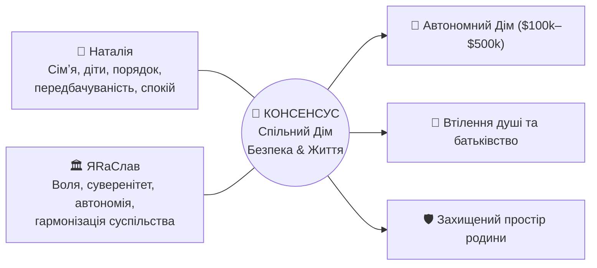
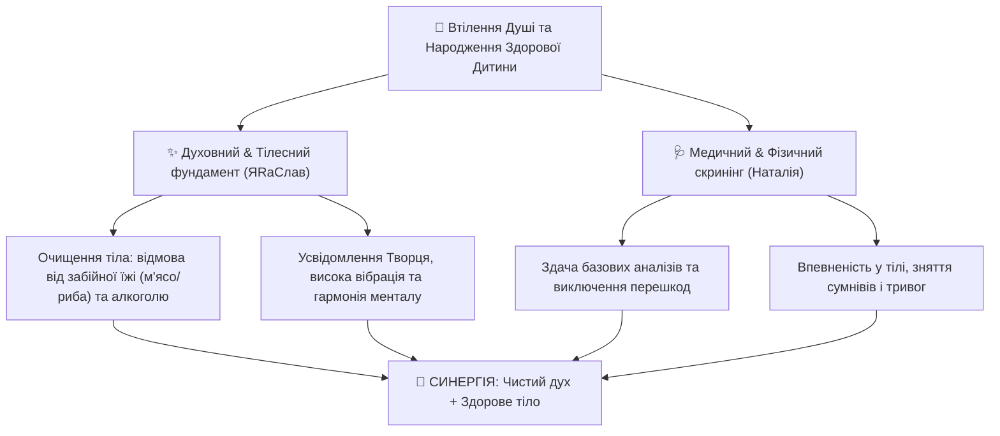

[← Головне меню (README.md)](../README.md) | [← Досьє Наталії (README.md)](./README.md)

# 🌿 Спільний План Родини: Наталія & ЯRаСлав

> **Фундамент співіснування:** Консенсус, взаєморозуміння, порядок, захист життя та гармонізація суспільства. Бути людьми вигідно всім. Жити в консенсусі — вигідно всім.

---

## 🕊️ 1. Спільне Бачення та Цінності

### 1.1. Прагнення Наталії:
- **Сімʼя:** Збереження теплої атмосфери, турбота, партнерство, взаємна повага.
- **Діти:** Бажання стати мамою, народження здорових діток у безпечному та спокійному середовищі.
- **Порядок:** Чіткість у побуті, чистота, передбачуваність фінансів, психологічний спокій.

### 1.2. Прагнення ЯRаСлава:
- **Творення Життя та Воля:** Людина народжена жити і творити. Гармонізація суспільства замість людожерства і терору.
- **Духовна та тілесна чистота:** Усвідомлення єдності всього сущого та багатовимірності Творця в кожній людині. Відмова від забійної їжі (м'ясо, риба) та алкоголю задля очищення менталу й астрального тіла.
- **Суверенна та фінансова незалежність:** Платформа [Will-n-I](../../../nan.web/apps/3rdparty/will-n-i/README.md), крипто-незалежність, прямі контракти, захист прав суверена.
- **Інженерна автономія:** Побудова родинного оазису ([UA-Oasis](../../horod/farms/underground-oasis/index.md)).

---

## 👶 2. Діти та Батьківство: Втілення Душі та Підготовка Батьків

Поява дітей — це духовне рішення душі втілитися у фізичному світі для проходження свого запланованого життєвого досвіду:

### Точки порозуміння:
1. **Духовна основа (бачення ЯRаСлава):** Діти народжуються там, де душа хоче пройти свій життєвий досвід. Для налаштування контакту з тонким (астральним) тілом та створення чистого простору необхідна відмова від забійної їжі (м'ясо, риба) та алкоголю. Очищення раціону — це прояв любові до життя та ненасильства.
2. **Медична перевірка (бачення Наталії):** Здати базові медичні аналізи, щоб перевірити фізичний стан організму, зняти хвилювання та забезпечити безпечний перебіг вагітності.
3. **Консенсус:** Одне доповнює інше. Ми поєднуємо **духовне й тілесне очищення (детокс раціону)** та **спокійний медичний чекап**, щоб батьки були готові комплексно — на духовному, ментальному та тілесному рівнях.

---

## 🏡 3. Спільна Ціль: Автономний Дім ($100k — $500k)

Будинок розглядається як родове гніздо, де поєднуються порядок і затишок Наталії з передовою автономією ЯRаСлава.

### Рівень А: Базовий Автономний Дім (~$100,000)
- **Горизонт:** 2026–2027.
- **Ціль:** Швидке створення захищеного простору для сім'ї та дітей.
- **Складові:** Земельна ділянка, теплий швидкомонтований контур, свердловина з фільтрами, септик, сонячна електростанція 5–8 кВт (LiFePO4).

### Рівень Б: Капітальний Родовий Комплекс (~$500,000)
- **Архітектурна база:** Проєкт [UA-Oasis (Underground Oasis)](../../horod/farms/underground-oasis/index.md) (див. [README](../../horod/farms/underground-oasis/README.md), [business-plan.md](../../horod/farms/underground-oasis/business-plan.md), [architecture-map.md](../../horod/farms/underground-oasis/architecture-map.md)).
- **Складові:**
  - Підземний/напівпідземний житловий та фермерський комплекс подвійного призначення (купол Ø12м, кліматичні тунелі).
  - 100% геотермальна та сонячна енергія, накопичувачі енергії, V2G.
  - Власна свіжа органічна їжа цілий рік (агрономія, субтропіки, зелень, басейн).
  - Повний захист від природних катаклізмів, криз та воєнних загроз.

---

## ⚖️ 4. Фінансова та Правова Стійкість

Під час кризи, війни та свавілля банківсько-державної системи (блокування рахунків, тиск) ми не впадаємо у паніку і не ведемо сліпу «війну»:
1. **Гармонізація суспільства замість людожерства:** Через правовий протокол [Will-n-I](../../../nan.web/apps/3rdparty/will-n-i/MANIFESTO.md) ми спокійно відновлюємо справедливість і притягуємо порушників до відповідальності за Конституцією.
2. **Крипто-незалежність:** Взаємодія через децентралізовані криптогаманці, прямі контракти, готівковий резерв та бартер — це робить родину нечутливою до банківського терору.
3. **Множинні джерела фінансування:**
   - Запуск власної платформи розробки та консалтингу.
   - Фіналізація комерційних релізів (Industrial Bank).
   - Енергетичні модулі Horod Energy.
   - Запуск DAO та залучення співзасновників під [UA-Oasis](../../horod/farms/underground-oasis/cofounder-agreement.md).

---

## 🗓️ 5. Покроковий План Синхронізації на 2026 рік

| Етап | Зміст робіт | Мета для сім'ї | Хто веде |
| :--- | :--- | :--- | :--- |
| **1. Здоров'я & Батьківство** | Спільний детокс (тестовий період без забійної їжі/алкоголю) + базові медичні чекапи | Тілесна та духовна готовність до зачаття | Наталія + ЯRаСлав |
| **2. Енергетичний затишок** | Резервне живлення квартир (проєкт Світлани: LiFePO4 станція) | Спокій у побуті при відключеннях світла | Спільний |
| **3. Фінансовий рух** | Дохід через крипту та прямі контракти в обхід заблокованих карток | Стабільний бюджет на щоденні потреби й накопичення | ЯRаСлав |
| **4. Проєктування Дому** | Адаптація [UA-Oasis](../../horod/farms/underground-oasis/index.md) під потреби сім'ї з дітьми, вибір локації | Готовий план ділянки та будівництва | Спільний |

---

## 📱 6. Як цим користуватися з телефону

1. **Для Наталії (Android):**
   - **Онлайн:** Відкрити репозиторій у браузері або застосунку **GitLab** — усе читається як гарно зверстана стаття.
   - **Офлайн (найзручніше):** Застосунок **Obsidian** (Android) з плагіном *Obsidian Git* — автономна база сімейних планів і схем завжди під рукою.
2. **Для ЯRаСлава (iPhone / iPad):**
   - **Obsidian / Working Copy:** Синхронізація планів, робота з гілками та текстами.
   - **iSH Shell:** Термінал Alpine Linux (`apk add git`) для прямої консольної роботи з репозиторієм на iOS.

---
[← Головне меню (README.md)](../README.md) | [← Досьє Наталії (README.md)](./README.md)
